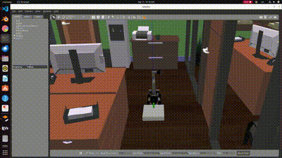

# Approach and Retrieve Robot Arm Control

This project provides a framework for controlling a robot arm and gripper using ROS 2 and MoveIt!. The robot can perform complex tasks such as approaching an object, grasping it, and retreating with precision and control. The arm movements are planned using the MoveIt! motion planning framework, and the gripper is controlled using predefined actions like opening and closing. The motion parameters such as velocity, acceleration, and planning time are dynamically configurable for each phase of the task, making the framework adaptable to different robotic setups and tasks.

## Features

- **Pre-grasp Planning**: Moves the robot arm to a predefined "pre-grasp" pose.
- **Cartesian Movements**: Approaches or retreats from the object in a straight line using Cartesian path planning.
- **Gripper Control**: Supports opening and closing the gripper using named actions.
- **Modular and Flexible**: Task execution is divided into modular functions that make it easy to extend and customize.
- **ROS 2 Integration**: Runs as a ROS 2 node, allowing integration with the larger ROS 2 ecosystem and other ROS 2 tools.

## Task Execution Workflow

The task workflow consists of the following steps:

1. Move the robot arm to a home position.
2. Open the gripper before approaching the object.
3. Move the robot arm to the pre-grasp position.
4. Approach the object using a Cartesian path.
5. Close the gripper to grasp the object.
6. Retreat from the object using a Cartesian path.
7. Open the gripper to release the object.
8. Move the robot arm back to the home position.

## Demonstration

